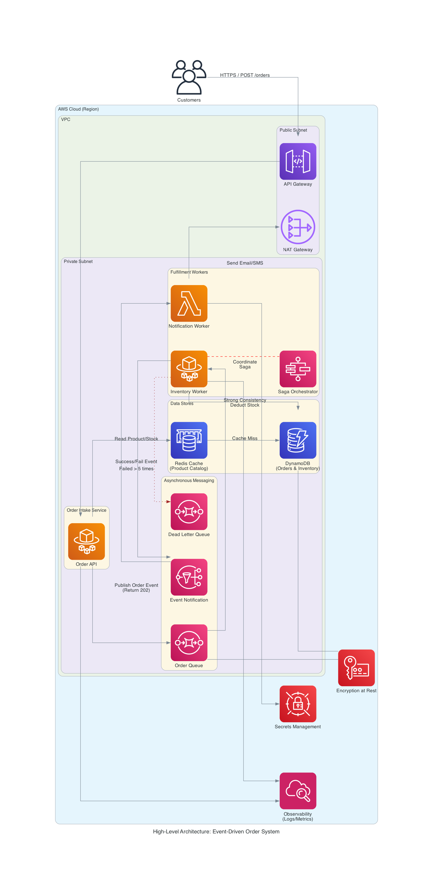
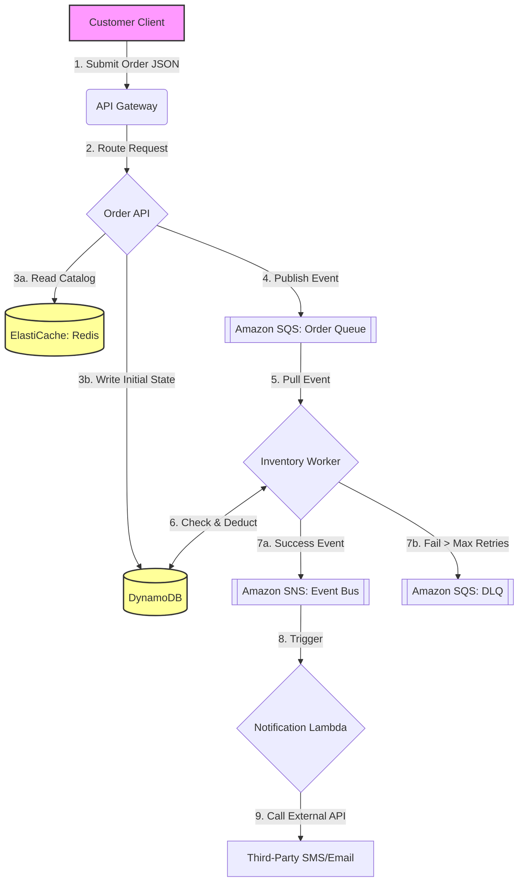
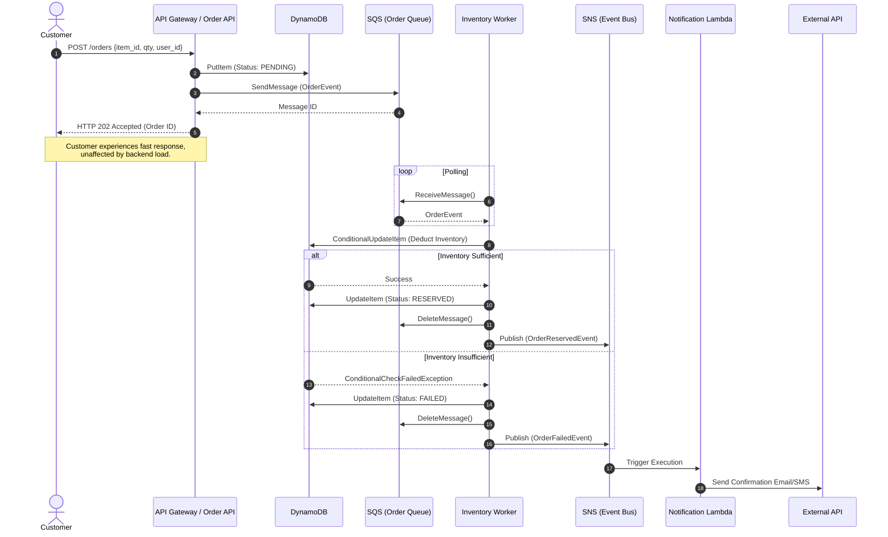

# Architecture Design Document

## a. Executive Summary

### Business Goals

* **Provide a Premium Customer Experience:** Ensure smooth checkout and timely order confirmation notifications (Email/SMS) during everyday operations and major sales events (e.g., Black Friday, flash sales), boosting customer satisfaction and brand loyalty.
* **Optimize Inventory Management to Maximize Profit:** Establish real-time inventory validation to eliminate overselling and the associated costs of customer complaints and refunds, securing steady revenue growth.
* **Data-Driven Business Decisions:** Analyze order trends to help marketing and procurement teams plan promotions and restock strategies more accurately.

### Success Criteria

* **Order Processing Reliability:** All successfully submitted orders must be processed with an "at-least-once" guarantee. Zero lost orders.
* **Inventory Accuracy:** Strong consistency between order creation and inventory deduction is maintained, keeping the overselling rate at 0%.
* **System Elasticity:** The system automatically scales during unpredictable traffic spikes. The core order intake function must remain highly available with low latency.

### Constraints

* **Architectural Requirements:** The system must adopt asynchronous workflows and an event-driven architecture to decouple services.
* **Cost Efficiency:** As a mid-size enterprise, infrastructure setup and maintenance costs must be optimized to avoid over-provisioning idle resources.

### Risks

* **Complexity of Asynchronous Processing:** An event-driven architecture might introduce challenges with eventual consistency, potentially causing brief discrepancies in displayed inventory if not handled properly.
* **Duplicate Processing:** Because the system guarantees at-least-once processing, a lack of idempotency design could lead to duplicate charges or repeated notification emails.
* **Inaccurate Traffic Estimation:** Extreme, unforeseen traffic spikes (e.g., a viral influencer endorsement) could overwhelm load balancing and scaling strategies, leading to brief system unavailability.

## b. High-Level Architecture

This section details the system's structural components, how data flows through them, and the specific sequence of operations for the core order fulfillment process.

### Component Diagram

*(Note: The Component Diagram above is generated via Infrastructure-as-Code using the `diagrams` Python package.)*

The architecture is built entirely on AWS managed services, utilizing a VPC for network isolation. An API Gateway handles incoming traffic, routing it to an ECS Fargate Order API. To handle massive scale, the system is fully decoupled: the API publishes order events to an SQS Queue, which are then processed asynchronously by background Fargate Workers. State is durably stored in DynamoDB, with ElastiCache (Redis) providing a high-performance read layer. **To support business requirements for analytics on order trends, completed order events are periodically exported from DynamoDB (e.g., via DynamoDB Streams) into an Amazon S3 Data Lake for offline processing by the data team.**

### Data Flow Diagram

This diagram illustrates the lifecycle of an order and the state transitions within the system.

### Sequence Diagram: Core Order Fulfillment

This sequence diagram details the "Happy Path" of the asynchronous, event-driven order processing workflow, demonstrating the Queue-Based Load Leveling pattern.

### Technology Choices & Tradeoffs

*   **Compute (AWS Fargate & Lambda):** 
    *   *Choice:* Serverless compute was chosen over provisioning EC2 instances or maintaining a Kubernetes cluster. 
    *   *Tradeoff:* Provides zero-maintenance scaling and eliminates OS patching overhead, but introduces potential "cold start" latency (for Lambda) and less granular control over the underlying host OS.
*   **Database (Amazon DynamoDB):**
    *   *Choice:* A NoSQL database was selected over a relational database (like PostgreSQL).
    *   *Tradeoff:* DynamoDB excels at absorbing massive, unpredictable write spikes (Black Friday) with single-digit millisecond latency. However, it sacrifices complex JOIN capabilities and requires strict adherence to single-table design principles.
*   **Messaging (Amazon SQS & SNS):**
    *   *Choice:* Point-to-point queues (SQS) combined with Pub/Sub (SNS) were chosen over a complex event streaming platform like Apache Kafka.
    *   *Tradeoff:* SQS/SNS are vastly simpler to configure and operate for standard asynchronous task processing. They lack the long-term event replayability and complex stream processing features of Kafka, which are deemed unnecessary for this MVP scope.

## c. Mapping to Well-Architected Pillars

This architecture fundamentally aligns with the six pillars of the AWS Well-Architected Framework, ensuring a robust, scalable, and efficient system:

### 1. Operational Excellence
We treat operations as code and utilize deep observability. By implementing **Distributed Tracing (TraceID)** and **Centralized Logging**, operators can track complex asynchronous workflows. The use of **Synthetic Checks** ensures business-critical paths are proactively monitored, while predefined **Runbooks** and incident escalation paths guarantee disciplined, rather than reactive, incident management.

### 2. Security
A defense-in-depth strategy protects customer PII. The **Principle of Least Privilege** is enforced via strict IAM Roles for machine-to-machine communication. **Network Boundaries** are established using VPC private subnets to shield core databases from public access. Furthermore, all data is **encrypted at rest (KMS)** and **in transit (TLS)**, with dynamic secret management handled by AWS Secrets Manager.

### 3. Reliability
The system is designed to gracefully handle failures. **Queue-Based Load Leveling (Amazon SQS)** protects the database from traffic spikes. The **Saga pattern** ensures data consistency without tight coupling. For external dependencies, **Circuit Breakers** and **Retry with Exponential Backoff** prevent cascading failures. Core data stores (DynamoDB, SQS) utilize synchronous **Multi-AZ replication** to achieve near-zero RPO.

### 4. Performance Efficiency
The architecture selects purpose-built data stores (Polyglot Persistence) to meet demand. **Amazon DynamoDB** provides single-digit millisecond latency for high-throughput write bursts during sales events. The **Cache-Aside pattern** utilizing **Amazon ElastiCache (Redis)** offloads read-heavy operations, drastically improving the performance of the product catalog while protecting backend databases.

### 5. Cost Optimization
As a mid-size retailer, avoiding idle infrastructure is critical. The use of managed and serverless components (SQS, DynamoDB Auto-scaling) ensures a **pay-as-you-go** model, scaling resources up only when demand dictates and down during off-peak hours. Implementing a caching layer also significantly reduces the provisioned read capacity costs of the primary database.

### 6. Sustainability (Encouraged)
By adopting a cloud-native, event-driven architecture, we maximize resource utilization. Relying on AWS managed services and auto-scaling compute pools ensures that we are not powering and cooling idle servers. Resources automatically scale to zero or minimal baseline levels when not in use, directly reducing the overall carbon footprint of the application.

## d. Cloud Design Patterns Used

To meet the business goals of high availability during traffic spikes, zero overselling, and guaranteed at-least-once processing, this architecture leverages the following five cloud design patterns:

### 1. Queue-Based Load Leveling

*   **Application:** An asynchronous message queue (e.g., Amazon SQS) is placed between the API Gateway/Order Service and the backend fulfillment workers.
*   **Justification:** During unpredictable traffic spikes (like Black Friday), the rate of incoming orders drastically exceeds the database's capacity to deduct inventory. By accepting the order quickly and placing it in a queue, the system returns a fast response to the customer. Backend workers can then process these queued orders at their own sustainable pace, protecting the database (e.g., Amazon DynamoDB) from being overwhelmed and ensuring the system remains responsive.

### 2. Saga (Orchestration)

*   **Application:** A centralized orchestrator (e.g., AWS Step Functions) manages the distributed transaction of placing an order, which spans multiple independent services (Order Creation -> Inventory Deduction -> Notification).
*   **Justification:** In an event-driven, microservices architecture, traditional database locks (ACID transactions) across different databases are not feasible. The Saga pattern breaks the large transaction into a series of local transactions. If inventory deduction fails (e.g., out of stock), the orchestrator triggers a compensating transaction to explicitly cancel the pending order and notify the customer, guaranteeing eventual consistency and absolutely zero overselling.

### 3. Retry + Backoff

*   **Application:** Applied to any interactions with external dependencies or unreliable networks, particularly the Notification Service (calling external Email/SMS APIs via Amazon SNS) and Payment Gateways.
*   **Justification:** Transient faults, such as momentary network glitches or temporary unavailability of a third-party SMS provider, are common in the cloud. Instead of immediately failing an order notification, the system automatically retries the operation with an exponentially increasing delay (e.g., 1s, 2s, 4s). This fulfills the "at-least-once processing" requirement without overwhelming the struggling external service with immediate, aggressive retries.

### 4. Circuit Breaker

*   **Application:** Implemented in the services that call external third-party APIs (like the Email/SMS provider or Payment Gateway).
*   **Justification:** While Retry + Backoff handles transient errors, the Circuit Breaker pattern handles long-lasting outages. If the external SMS API goes down completely, continuous retries would exhaust the system's threads, connections, and memory, potentially bringing down the entire Notification Service. The circuit breaker detects the sustained failure, "trips" (opens) to immediately reject further calls, and periodically allows a few test requests through (half-open) to check if the external service has recovered, thereby preserving system stability.

### 5. Cache-Aside

*   **Application:** A distributed cache (e.g., Amazon ElastiCache for Redis) is placed alongside the primary database to serve read-heavy data, such as product catalog information and current available inventory counts.
*   **Justification:** During high-traffic events, the vast majority of operations are reads (customers browsing products) rather than writes (placing orders). By checking the cache first and only querying the database if the data is missing (cache miss), the system drastically reduces the read load on the primary database, improving overall performance efficiency and lowering database provisioning costs.

## e. Data Management Strategy

### Consistency Model

This architecture employs a **Mixed Consistency Model** to balance high throughput during traffic spikes with the strict requirement of zero overselling:

*   **Eventual Consistency (Cross-Service):** The overarching order fulfillment process relies on eventual consistency. When a customer places an order, the Order Service immediately returns a success response after publishing an event to the message queue (e.g., Amazon SQS), before the inventory is actually deducted. This asynchronous decoupling guarantees high availability and low latency for the critical "order intake" path.
*   **Strong Consistency (Inventory Deduction):** While the system as a whole is eventually consistent, the specific operation of deducting inventory within the database (e.g., Amazon DynamoDB) utilizes strong consistency (via conditional writes or transactions). This ensures that concurrent workers processing orders for the same item never overdraw the available stock, completely eliminating the risk of overselling.

### Storage Types and Roles (Polyglot Persistence)

To ensure each component operates optimally, the system utilizes purpose-built data stores:

*   **Amazon DynamoDB (NoSQL Key-Value/Document Store):**
    *   **Role:** The primary system of record for Order Data (status, items, customer info) and Inventory State (current stock levels).
    *   **Justification:** Provides single-digit millisecond performance at any scale, seamlessly handling massive write bursts during sales events without the complex scaling operations required by traditional relational databases.
*   **Amazon ElastiCache for Redis (In-Memory Data Store):**
    *   **Role:** The caching layer serving the product catalog and read-heavy inventory availability checks for the frontend.
    *   **Justification:** Absorbs the vast majority of read traffic (browsing customers), significantly reducing the load and provisioned capacity costs on the primary database while delivering sub-millisecond response times.
*   **Amazon S3 (Object Storage):**
    *   **Role:** Storage for unstructured data, including product images, frontend static assets, and long-term archiving of historical order data for analytics.
    *   **Justification:** Offers the lowest cost per GB for massive volumes of unstructured data and integrates natively with analytics tools for data-driven business decisions.

### Replication and Durability Strategy

To guarantee high availability (HA) and protect against data loss (Disaster Recovery), the following strategies are implemented:

*   **Multi-AZ Replication:** Core data stores like Amazon DynamoDB and Amazon SQS inherently replicate data synchronously across multiple Availability Zones (AZs) within a region. If a physical data center experiences an outage, the system automatically fails over to a healthy AZ without data loss or significant downtime.
*   **Point-in-Time Recovery (PITR):** Continuous backups are enabled on the primary database (DynamoDB). In the event of an application logic error or accidental data deletion by an operator, the database can be restored to any exact second within the preceding 35 days, providing robust protection against logical corruption.

## f. Reliability & Resilience Plan

To guarantee business continuity and minimize customer impact during unexpected failures, this system is designed with a strong focus on resilience, self-healing, and proactive testing.

### Failure Mode Analysis (FMEA)

A subset of the critical component failure analysis includes:

*   **Component: Third-Party SMS/Email API (Notification Service)**
    *   **Failure:** The external provider experiences a severe outage or severe latency.
    *   **Impact:** Customers do not receive order confirmation messages, potentially leading to increased support tickets, though core order processing remains unaffected.
    *   **Mitigation:** The system implements a **Circuit Breaker** to prevent resource exhaustion and relies on a **Retry + Exponential Backoff** mechanism to deliver the notifications once the external service recovers.
*   **Component: Amazon ElastiCache (Redis) Cluster**
    *   **Failure:** The primary cache node crashes due to an out-of-memory error.
    *   **Impact:** Read traffic is forced to bypass the cache (Cache Miss) and query the primary database (DynamoDB) directly, causing a sudden spike in database read capacity consumption.
    *   **Mitigation:** ElastiCache is configured in a Multi-AZ cluster with automatic failover. The application uses the **Cache-Aside** pattern, so a cache failure degrades performance gracefully rather than halting the system. DynamoDB's auto-scaling will absorb the temporary read spike.

### Chaos Scenarios (Chaos Engineering Drill Plan)

To validate the architecture's resilience, the following chaos experiments are planned:

*   **Scenario 1: Massive Compute Node Termination (Simulating AZ Outage)**
    *   **Action:** Forcibly terminate 50% of the active Inventory Worker containers during a simulated load test.
    *   **Expected Result:** No orders are dropped. The SQS queue depth will temporarily spike as processing slows down. The infrastructure orchestrator (e.g., ECS/EKS Auto Scaling) must detect the increased queue metric and provision replacement containers within 3-5 minutes, eventually draining the backlog.
*   **Scenario 2: Poison Pill Message Injection**
    *   **Action:** Inject a deliberately malformed order payload into the SQS queue that will intentionally crash the worker attempting to process it.
    *   **Expected Result:** The worker processes fail and restart. After a configured number of retries (e.g., 5 times), the message must be automatically moved to a Dead Letter Queue (DLQ) rather than blocking the main pipeline, allowing valid orders to continue processing smoothly.

### Recovery Strategies

In the event of systemic failures, predefined recovery strategies dictate the operational response:

*   **Automated Self-Healing:** The primary defense line. Stateless compute nodes (API and Workers) are managed by orchestration tools that automatically replace unhealthy or crashed instances without human intervention.
*   **Logical Data Corruption Recovery:** If a bad code deployment corrupts inventory records, operators will utilize DynamoDB's Point-in-Time Recovery (PITR) to restore the specific table to a state mere seconds before the deployment occurred.
*   **DLQ Redrive Strategy:** For messages trapped in the Dead Letter Queue due to temporary bugs, a Runbook exists detailing how an operator can analyze the failure, deploy a hotfix, and execute a script to push the failed messages back into the primary queue for successful processing.

### RPO/RTO Definitions

These targets define the business expectations for disaster recovery scenarios:

*   **Recovery Point Objective (RPO): Near-Zero.**
    *   **Definition:** The maximum acceptable amount of data loss.
    *   **Justification:** Losing accepted orders is catastrophic for an e-commerce business. By utilizing deeply integrated AWS managed services (DynamoDB, SQS) that feature synchronous Multi-AZ replication, data is durably persisted the moment an API responds with `202 Accepted`. A single data center failure will not result in lost orders.
*   **Recovery Time Objective (RTO): < 5 Minutes.**
    *   **Definition:** The maximum acceptable downtime before the system is restored to functional order.
    *   **Justification:** Leveraging Infrastructure-as-Code (Terraform) and stateless containerized applications allows for rapid redeployment of the entire compute stack into a healthy AZ or even a secondary region if a massive, catastrophic failure occurs, satisfying the swift recovery requirement.

## g. Cost Model & Performance Model

Detailed cost estimates, service-by-service breakdowns, and performance scaling scenarios (including RPS thresholds and bottleneck analysis) are provided in the accompanying spreadsheet.

*   **Please refer to the attached `cost-estimation.csv` file for the complete Cost Model and Performance Evaluation.**

### Summary

The architecture is highly cost-efficient due to its reliance on serverless and managed services. The estimated monthly baseline cost for handling moderate traffic (including High Availability configurations like Multi-AZ Redis and NAT Gateways) is approximately **$450/month**. 

Because compute (Fargate) and database writes (DynamoDB On-Demand) are elastic, the system incurs higher costs only during actual traffic spikes (e.g., Black Friday), avoiding the expense of permanently over-provisioned infrastructure. The primary performance bottleneck under extreme load is anticipated to be DynamoDB Write Capacity, which is mitigated by the upstream SQS queue leveling the load.

## h. Security Model

This system employs a defense-in-depth approach, adhering to the AWS Well-Architected Security Pillar to protect customer data and maintain system integrity.

### Threat Model

Before defining the defensive mechanisms, we identify the primary threats to this e-commerce architecture:
*   **Data Breach (PII Exfiltration):** Unauthorized access to the DynamoDB or S3 buckets leading to the theft of customer names, addresses, and order histories.
*   **Unauthorized System Access:** Malicious actors or compromised internal accounts gaining access to internal microservices or the Redis cache.
*   **Credential Leakage:** Hardcoded API keys (e.g., for the Notification Service) being exposed in source code repositories or CI/CD logs.

To mitigate these modeled threats, the following security domains are strictly enforced:

### Identity & Access Control

Access is strictly governed by the **Principle of Least Privilege** using AWS Identity and Access Management (IAM):

*   **Machine-to-Machine (M2M) Authorization:** Every compute component operates under a specific IAM Role with highly restricted permissions.
    *   *Example:* The `Order Service Role` is only granted `sqs:SendMessage` to the specific Order Queue and cannot read messages or directly access the database. Conversely, the `Inventory Worker Role` can read from the queue and perform `dynamodb:UpdateItem` on the Inventory table, but cannot modify other tables.
*   **Human Access:** Developers and operators use AWS IAM Identity Center (SSO) with multi-factor authentication (MFA). Baseline access is Read-Only. Elevated permissions required for debugging or deployment are temporary and audited.

### Data Encryption

To protect against Data Breach threats and ensure compliance, data is encrypted across all states:

*   **Encryption in Transit:** All external communication between the customer's client and the API Gateway is strictly enforced over HTTPS (TLS 1.2+). Internal communication between microservices, queues, and databases within the AWS network also utilizes TLS encryption.
*   **Encryption at Rest:** All persistent storage layers, including Amazon DynamoDB, Amazon SQS, Amazon ElastiCache, and Amazon S3 backups, are configured with at-rest encryption enabled by default using AWS Key Management Service (KMS) managed keys.

### Network Boundaries

To prevent Unauthorized System Access, the architecture is deployed within an Amazon Virtual Private Cloud (VPC) to establish strict network isolation:

*   **Public vs. Private Subnets:** Only the API Gateway/Load Balancers and NAT Gateways reside in public subnets with internet access. All compute resources (Order Service, Workers) and backend datastores (ElastiCache, RDS/DynamoDB via VPC Endpoints) are deployed in private subnets, completely shielding them from direct internet ingress.
*   **Security Groups:** Acting as stateful virtual firewalls, Security Groups are configured to only allow expected traffic flows. For instance, the Redis cache Security Group only accepts inbound connections on port 6379 originating specifically from the internal Worker Security Group.

### Secrets Management

To eliminate the threat of Credential Leakage, no hardcoded credentials, API keys, or database passwords exist within the source code, environment variables, or CI/CD pipelines.

*   **Centralized Storage:** Sensitive configuration data, such as third-party API keys (e.g., Twilio/SendGrid for notifications) and database credentials, are securely stored in **AWS Secrets Manager**.
*   **Dynamic Retrieval:** Applications authenticate via their IAM roles to dynamically retrieve secrets into memory only at runtime. This allows for automated secret rotation without requiring code deployments or downtime.

## i. Operations & Observability Plan

To ensure Operational Excellence and maintain system reliability during high-traffic events, the system implements a comprehensive observability and incident response strategy.

### Log Aggregation

*   **Centralized Logging:** All microservices (Order API, Workers) output structured JSON logs. These logs are aggregated into **Amazon CloudWatch Logs** (or an ELK/Datadog stack).
*   **Distributed Tracing:** A unique `TraceID` is generated at the API Gateway and injected into every log entry across the asynchronous pipeline (API -> SQS -> Worker). This allows operators to trace the exact lifecycle of a specific order across decoupled services for rapid debugging.

### Metrics & Dashboards

We utilize purpose-built dashboards to separate business outcomes from infrastructure health:

*   **Business Dashboard (Executive View):** Tracks core KPIs such as Orders per Minute, Total Revenue, and Inventory Deduction Success Rate.
*   **Technical Dashboard (Engineering View):** Monitors critical system metrics, including:
    *   **Application Metrics:** API Latency (p90/p99), HTTP 5xx Error Rates.
    *   **Infrastructure Metrics:** SQS `ApproximateNumberOfMessagesVisible` (Queue Depth), DynamoDB Consumed Read/Write Capacity, and Container CPU/Memory utilization.

### Synthetic Checks

While internal Health Checks are used for load balancer traffic routing, **Synthetic Checks** are deployed for end-to-end business validation:

*   **Implementation:** An isolated AWS Lambda function (or Datadog Synthetic test) runs every minute, simulating a real user by sending a `POST /orders` request with a test payload.
*   **Justification:** This black-box testing ensures that the entire critical path (API -> Queue -> Database) is functioning correctly from the customer's perspective, catching complex systemic failures that simple component-level health checks might miss.

### Alerts, Runbooks, and Escalation Paths

Incident response is driven by symptom-based alerting tied to business impact, rather than noisy infrastructure thresholds:

*   **Alerting Strategy:**
    *   **P0 (Critical):** Triggered by actionable symptoms, such as the Synthetic Check failing consecutively, API 5xx error rate > 5%, or SQS Queue depth exceeding a threshold (indicating stalled workers).
    *   **P2 (Warning):** Triggered by predictive metrics, such as DynamoDB capacity approaching its provisioned limit, allowing proactive scaling before customer impact occurs.
*   **Runbooks:** Every alert is linked to a specific Runbook—a documented SOP guiding the on-call engineer through immediate triage steps, diagnostic queries, and known mitigation actions.
*   **Escalation Path:** Managed via tools like PagerDuty:
    1.  **Level 1 (Immediate):** Primary On-call Engineer is paged.
    2.  **Level 2 (15 mins unresolved):** Escalated to the Tech Lead / SRE Lead.
    3.  **Level 3 (30 mins unresolved / SLA impacted):** Escalated to Engineering Management and triggers the external customer communication protocol.
