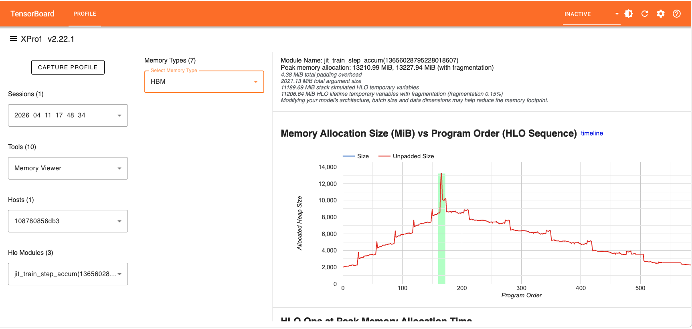
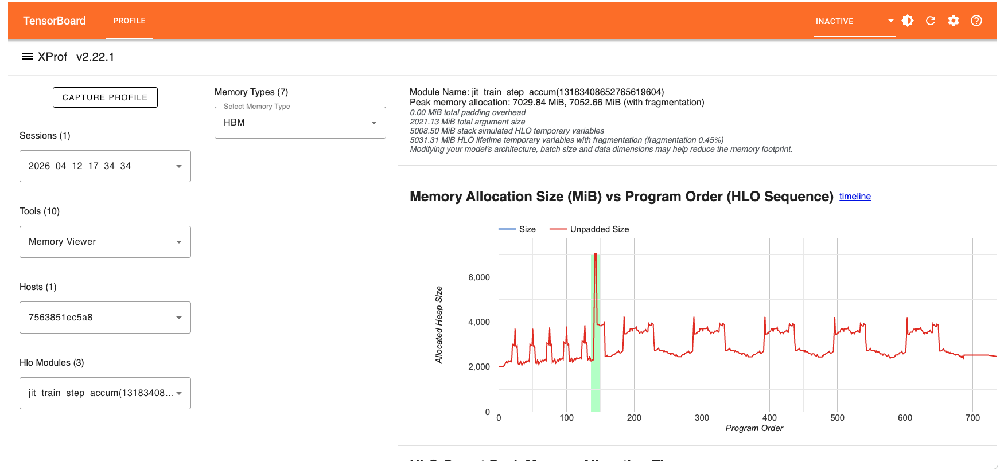
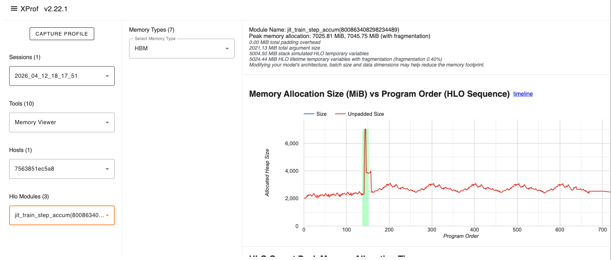
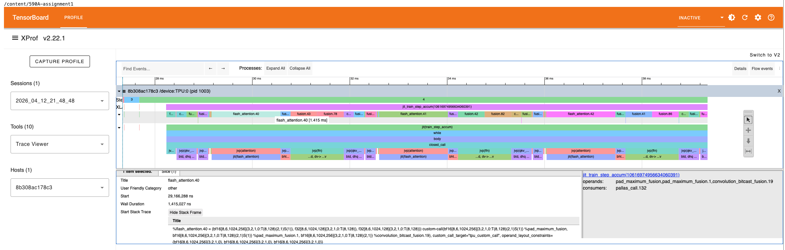
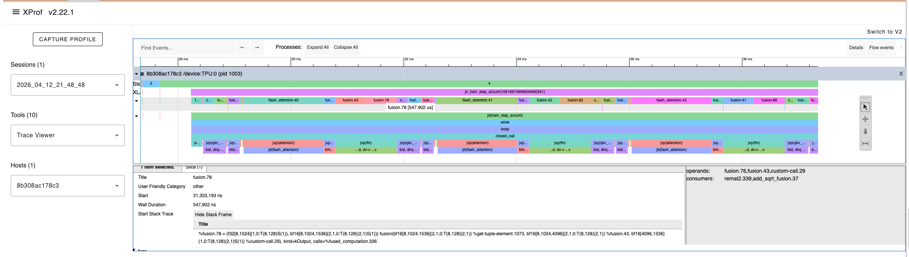
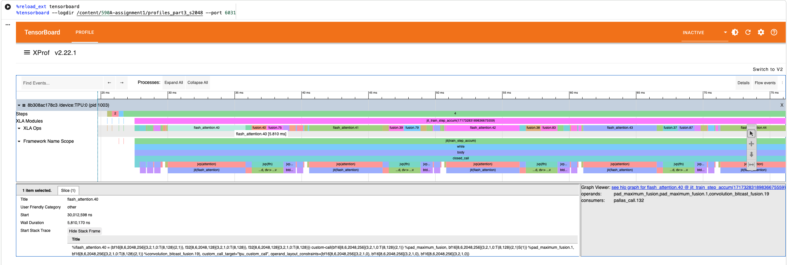
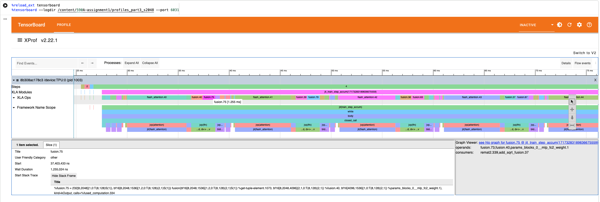
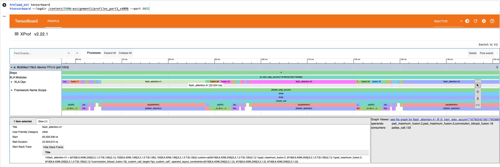
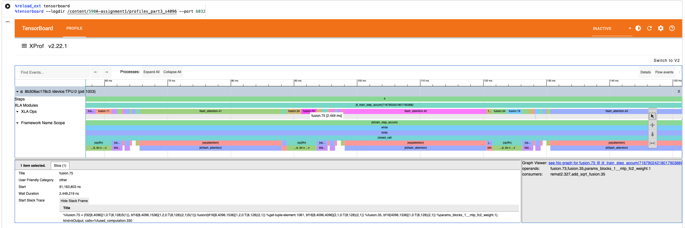

CSEP 590A - Systems for ML

Name      : Aaron Chen  
Student ID: aaronyc  

# Part1

+ Step 1 - `pre_attn_norm`

```python
with jax.named_scope("pre_attn_norm"):
    attn_in = rmsnorm_forward(x)
```

This step applies RMSNorm to the input. It computes `scale = sqrt(mean(x^2) + eps)` and normalizes the input as `output = x / scale`. The purpose is to stabilize the subsequent attention computation.

The shape of `x` is `(B, T, d_emb)`. `rmsnorm_forward` does not change the shape, so `attn_in` is also `(B, T, d_emb)`.

+ Step 2 - `attn_forward`

```python
attn_out = attn_forward(params.attn, attn_in, mask, freqs)
```

This step performs self-attention on the normalized hidden states. Given `attn_in` with shape `(B, T, d_emb)`, the model first projects it into q, k, v tensors using `wq`, `wk`, and `wv`. With `d_emb=1536`, `q_heads=6` , and `kv_heads=6`, the head dimension is 256, so q, k, v each have shape `(B, T, 6, 256)`.

Then the model applies RoPE positional information using `freqs`, performs scaled causal self-attention, and projects the result by `wo` back to shape `(B, T, d_emb)`. Therefore, `attn_out` has shape `(B, T, 1536)`.

+ Step 3 - `residual`

```python
with jax.named_scope("residual"):
    x = x + attn_out
```

The residual connection adds the attention output back to the original input to preserve the original representation while allowing the attention sublayer to contribute an incremental update.

The shape of `x` remains the same, `(B, T, 1536)`.

+ Step 4 - `post_attn_norm`

```python
with jax.named_scope("post_attn_norm"):
    ffn_in = rmsnorm_forward(x)
```

This step is similar to Step 1, but it normalizes the hidden states before the MLP sublayer instead of before attention. The purpose is to stabilize the input to the feed-forward network.

The shape of `ffn_in` remains the same, `(B, T, 1536)`.

+ Step 5 - `ffn`

```python
with jax.named_scope("ffn"):
    ffn_out = mlp_forward(params.mlp, ffn_in)
```

There are two linear layers and one non-linear transform in `mlp_forward`. The first linear layer expands the hidden dimension from `d_emb=1536` to `mlp_hidden_dim=4096`, allowing the model to transform each token representation in a larger feature space. Then `square(relu(x))` adds nonlinearity and sets negative values to zero. Finally, the second linear layer projects the activations back to `d_emb=1536`.

Therefore, `ffn_out` has shape `(B, T, 1536)`.

+ Step 6 - `residual`

```python
with jax.named_scope("residual"):
    x = x + ffn_out
```

This step is similar to Step 3, and the shape of `x` is `(B, T, 1536)`.

# Part2

## 1. Explain the memory spikes and the increases or decreases in memory usage, or other phenomenons. Relate these changes to the lifecycle of different memory states during training.

Based on the Memory Viewer profile (as shown in below screenshots), we can observe the following phenomena related to the memory state lifecycle during one training step:



1. Baseline (Model States): The initial memory usage starts at around 2,000 MB. This represents the persistent model weight and optimizer states that remain in HBM throughout the training process.
2. Steady Increase (Forward Pass): As the forward pass progresses (epoch 0 to ~160), memory usage increases steadily. This is due to the accumulation of activations from each layer. These activations are part of the residual states and must be stored to compute gradients during the backward pss.
3. Peak Memory Spike: The memory usage peak at ~13,000 MB just before the backward pass starts. This spike occurs because all forward activations are currently held in memory, and additional buffers are allocated for the loss calculation and the initial gradients for back propagation.
4. Decrease (Backward Pass): After the peak, memory usage gradually decreases. This corresponds to the lifecycle of activations ending, as the backward pass moves from the output layer back to the input, activations for each layer are freed once their respective gradients have been computed.
5. Final Drop: The final drop in memory usage at the end of the step represents the point where gradients and temporary backward buffers are deallocated after the optimizer update is complete.

## 2. Enable activation checkpointing by setting `activation_checkpointing: true`, run the experiment again with `project1-part2-activation.yaml`. How does this change the Memory Viewer profile? How does it affect the per-step training latency?

As shown in the Memory Viewer, the memory consume decreased significantly.



1. Peak Memory Reduction: The peak memory allocation drops dramatically from ~13,000 MB to ~7,000 MB.
2. Shape of the Curve: Instead of mountain-like climb during the forward pass, the memory curve now looks like a series of smaller, repeated spikes. The occurs because the model no longer saves all intermediate activations in the residual states.
3. Pre-step Training Latency: Activation checkpointing increases the per-step training latency because of trade computation for memory approach.

## 3. Enable the Pallas FlashAttention kernel by setting `attn_impl: flash_attn`, run the experiment again with `project1-part2-flash-attn.yaml`. How does this change the Memory Viewer profile?



1. Flat Forward Pass Profile: Unlike the baseline profile where memory usage climb steadily, the FlashAttention profile shows an almost flat memory consumption during the forward pass. This indicates that the large TxT attention matrix is no longer being materialized in the HBM.
2. Efficiency of FlashAttentiion: This phenomenon confirms that FlashAttention avoids the memory bottleneck by performing the softmax and matrix multiplications in a tiled manner within SRAM, thus bypassing the need to store massive intermediate attention matrics in HBM. This effectively minimizes the residual states associated with the attention mechanism.

# Part3

## 1. Identify the two most time-consuming computations within a single Transformer layer.

The two most time-consuming computations within a single Transformer layer are:

1. Flash Attention: This operation computes the core self-attention mechanism, including QxK^T, softmax, and multiplication by V. In the Trace Viewer, it appears as `flash_attention.40` and dominates the per-layer latency.
2. MLP: This operation performs the two linear projections (d_emb -> mlp_hidden_dim -> d_emb) with a nonlinear activation in between. In the Trace Viewer, it appears as a fusion operation (e.g. `fusion.78`) whose operands include `mlp_fc2_weight`.

+ 1024 - Flash Attention


+ 1024 - MLP


## 2. For sequence lengths in [1024, 2048, 4096], measure and report the latency of these two operations. Describe the trend you observe, and explain it with the operation computational characteristics. Finally, for long-context training (e.g., 128K tokens), discuss which operation you expect to become the bottleneck.

| Operation | seqlen=1024 | seqlen=2048 | seqlen=4096 |
|-----------|-------------|-------------|-------------|
| Attention | 1,415 µs    | 5,810 µs    | 22,504 µs   |
| MLP       | 548 µs      | 1,255 µs    | 2,449 µs    |

1. Attention scales as O(n^2): Each time the sequence length doubles, the attention latency increases by roughly 4x (1,415 -> 5,810 -> 22,504). This is because the attention mechanism computes a score matrix of shape TxT, so both the computation and memory access scale quadratically with sequence length.
2. MLP scales as O(n): Each time the sequence length doubles, the MLP latency increases by roughly 2x (548 -> 1,255 -> 2,449). This is because the MLP applies the same linear projections independently to each token, so the computation scales linearly with sequence length.
3. Bottleneck at 128L: At seqlen=4096, attention is already 9.2x slower than MLP. Since attention grows quadratically while MLP grows linearly, this gap widens rapidly. At 128K tokens, attention would dominate the per-layer latency by several orders of magnitude, making it the clear bottleneck for long-context training.

+ 2048 - Flash Attention


+ 2048 - MLP


+ 4096 - Flash Attention


+ 4096 - MLP

