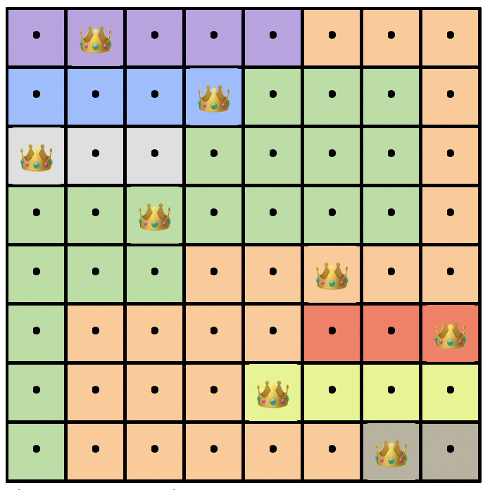
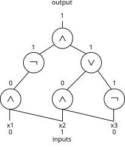

# Coding Assignment 2

Coding Assignment 2 contains two parts. Here is an overview. Details will be provided embedded in starter code in the [course repo](https://gitlab.cs.washington.edu/cars-26sp/cars-26sp-public).

* **Part 1:** (60 points) Choose one of the following SAT-based questions to solve. 
  * Option 1: Solving a puzzle involving placing queens on a chess board.
  * Option 2: Creating a schedule for an event given many constraints.
  * Option 3: Verifying that two digital circuits compute the same thing.
* **Part 2:** (60 points) Choose one of the following theory of EUF-based questions to solve.
  * Option 1: Solving a puzzle involving category matching.
  * Option 2: Verifying that two computer programs compute the same thing.
  * Option 3: Verifying matrix multiplication identities.
* **Part 3:** (30 points) Complete a short reflection (~100-200 words total) answering the following questions. You don't need to answer all of them, just pick a few that feel relevant. For this part only, apply the same course AI policy as for reading reflections, not the course AI policy for code.
  * Why did you choose to complete the options that you did? Do they hold any particular significance to you, or is there any reason you found them particularly interesting?
  * Can you draw any connections between problems in this homework assignment and your job, or your broader responsibilities? Can you imagine situations where you would personally use Z3? (If not yet, don't worry - we still have a lot of the course left to learn even more tools to unlock even broader applications!)
  * Did you enjoy this homework assignment? If so, what broader lessons did you take away from it, besides learning to solve these specific problems? If not, what kinds of problems would more useful to you?

You will submit the following to Gradescope:

* **One** Python file **for each part** corresponding to your chosen options, containing all of your source code. The expected filename is fixed per option (see the starter code). Do not use Python packages except Z3 and other built-in packages. Do not import more things from Z3 that are not already imported for you. Do not submit additional code files.
* If you select Part 2 Option 3, also include a PDF containing the requested chart.
* A Markdown (.md) or text (.txt) file containing your reflection response.

The autograder will automatically grade Parts 1 and 2. For Part 2 Option 3 the autograder will check correctness and speed of your verification queries; the chart PDF is reviewed manually. The autograder will run your code on a larger number of tests compared to what we have provided you in the starter code, and you will be able to immediately see the results. You *may* resubmit as many times as you like while submissions are open.

**Reminder:** The full course collaboration and AI policy may be found in the syllabus. To summarize: You *may* discuss problems at a high level with classmates, but do not share solutions, code, or detailed derivations with other students. You *may* use AI tools (Copilot, ChatGPT, Claude, etc.) as part of your workflow, but you must include a short attribution note in your submission listing which tools you used and how. 

## Part 1: SAT solving

For each problem below, a few hints will be given in the starter code. You will define functions that solve generic instances of each problem. Gradescope will automatically test your code against other instances.

### Option 1: Queens puzzle

Generalized chess is played on an $N \times N$ board. A queen is a chess piece that can move any number of squares up, down, left, right, or diagonally at exactly 45 degrees. If another piece is in a square that the queen can move to, we say that the queen can attack the other piece.

A basic version of the $N$-queens puzzle asks you to place $N$ queens on an $N \times N$ board such that none of them can attack each other. A slightly harder version of the $N$-queens puzzle divides the board into $N$ contiguous regions. Then, you must place exactly one queen in each region so that none of them can attack each other. An example problem with solution is given below.



Using Z3, encode $N$-queens puzzles using Boolean variables and SAT. Remember that your solution should work on all such puzzles, not just the example above.

### Option 2: Event scheduling

Suppose you are organizing a conference. The event will have $n$ participants and $m$ events across $k$ blocks of time, in a large venue where the number of rooms (e.g. number of simultaneous events) is not limited. Each participant indicates which events they would like to attend beforehand. 

For example, participant 1 might want to attend events 1 and 2, participant 2 wants to attend events 2 and 3, and participant 3 wants to attend events 1 and 3. In this case, even though each person only wants to attend 2 events, in order to have no scheduling conflicts, there must be at least 3 timeslots, one for each event. 

Your job is to decide whether a schedule exists in which *no* participant has a scheduling conflict, and if so, produce one. If no such schedule exists, return `None`.

Solve such scheduling problems by encoding the problem in Z3 using Boolean variables and SAT. (Stretch goal, not graded: extend your solution to minimize the number of conflicts when a zero-conflict schedule does not exist.) 

### Option 3: Digital circuit verification

A digital circuit is made out of *gates* and *wires*. Digital circuits generalize the Boolean formulas like $a \land (b \lor \lnot c)$ that we have primarily been discussing in this class, by allowing subexpressions to be more easily reused. An example is shown below.



Digital circuits like these form the building blocks of nearly all hardware design in the last half century. We will consider only circuits without loops (i.e. their underlying graph structure forms a DAG), these are called *combinatorial circuits*. Suppose you are building digital circuits and would like to know if your new design matches the functionality of an older design. Checking this by hand is difficult and prone to errors, so you need to use an automated tool.

In the starter code, we have declared some bare-bones classes intended to simulate digital circuits. Your job will be to take two objects of the `Circuit` class, built out of the basic logical gates `AND`, `OR`, and `NOT`, and determine if the two circuits compute the same function. You should do this *without* enumerating all possible input combinations to the circuit, since that would take a very long time.

Using Boolean variables and SAT in Z3, complete this circuit verification task efficiently.

Since circuit equivalence is a basic tool, Z3 provides built-in capabilities to make this easier. However, for pedagogical purposes, you *must* solve this problem explicitly using the Tseitin transformations that we learned about in class to transform these circuits into CNF formulas. You will expose your transformation as a separate function (`tseitin_encode`) that adds clauses to a Z3 solver and returns the Bool representing the circuit's output. The autograder will inspect those clauses to check that your encoding is genuinely in CNF. Your `equivalent` function will then use `tseitin_encode` to decide equivalence.

## Part 2: Equality of uninterpreted functions

For each problem below, a few hints will be given in the starter code. For options 1 and 2, you will define functions that solve generic instances of each problem, and Gradescope will automatically test your code against other instances. Option 3 is a fixed problem (matrix multiplication at several sizes); the autograder will run your code on that problem and check that the verification queries discharge within a time budget, and we will manually review your chart PDF.

All three options involve the concept of *axioms*. Remember that axioms in EUF are not quantified over variables. For example, when you add an axiom like $f(f(x)) = x$, this refers to a particular $x$ (and a particular $f$). The solver may say this is true for the function $f(x) = x^2$ with $x = 1$. The solver does *not* consider the fact that for this $f$, the statement $f(f(x)) = x$ is not always true.

### Option 1: Category matching puzzle

Puzzles like the following are often known as Zebra puzzles. In our version, there are **6 people** sharing **3 houses** (two per house — each person has a "roommate" who lives with them). Each person has a unique value for every category *except* House, and roommates share a house.

Example setup — 6 people, 3 houses, 4 other categories:

* House: Red, Yellow, Blue  (2 people per house)
* Nationality: Englishman, Spaniard, Ukrainian, Japanese, Norwegian, Italian
* Pet: Dog, Cat, Rabbit, Guinea Pig, Parrot, Hamster
* Drink: Tea, Coffee, Milk, Juice, Water, Cocoa
* Reading: Novel, Newspaper, Magazine, Tabloid, Encyclopedia, Almanac

Match each person with all of their properties. (Roommate pairings are left implicit — two people share a house iff they are roommates.) You will be given some clues about individual people, and some clues about what properties a person's *roommate* has, possibly negated — for example, "the Englishman's roommate drinks Tea," "the Spaniard's roommate does not own the Dog." Each clue identifies a *subject* (by one of their properties — or by the *absence* of a property, e.g. "the person who is not the Englishman...") and asserts a *target* property about either the subject or the subject's roommate. Both the subject-identifying property and the target property may independently be negated, so there are eight clue shapes in total.

The task is to solve puzzles like this in Z3, using uninterpreted functions to encode who has what property and who each person's roommate is.

### Option 2: Program verification

The following two (poorly-written) pieces of code are given to you.

```python
def program_1(a, b):
    t1  = f(a)
    t2  = g(t1, b)
    t3  = f(t2)
    t4  = g(a, b)
    t5  = g(t3, t1)
    t6  = f(t5)
    t7  = g(t1, b)
    t8  = f(t7)
    t9  = f(t5)
    t10 = g(t8, t1)
    t11 = f(t10)
    t12 = g(t9, t11)
    return t12

def program_2(a, b):
    u1 = f(a)
    u2 = g(u1, b)
    u3 = f(u2)
    u4 = g(u3, u1)
    u5 = f(u4)
    u6 = g(u5, u5)
    return u6
```

Do the two programs compute the same thing? It is not very clear! Using uninterpreted functions in Z3, you will encode programs like this and determine whether or not they are equivalent. More generally, the programs we expect you to handle are all straight-line programs with inputs `a` and `b`, and involving functions `f` of 1 variable and `g` of 2 variables. Every line defines a new variable as `f` or `g` of previous lines, and the last line is returned.

In addition, you may assume you know the following two facts about `f` and `g`:

* `f_idempotent` — `f(f(t)) = f(t)` for every term `t` (e.g. this is true for absolute value).
* `g_commutative` — `g(u, v) = g(v, u)` for every pair of terms `u`, `v` (e.g. this is true for addition and multiplication).

You will encode both of these facts as axioms and use them in your equivalence check; both axioms are always in effect.

### Option 3: Matrix identity verification

<!-- Source: an old problem from previous course materials using Racket/Rosette. The starter code has been ported to Python/Z3. -->

One common application of uninterpreted functions is to
accelerate verification by abstracting away the details of operations that are
expensive to compute.  In this problem, you will use
uninterpreted functions to accelerate two verification queries in a Z3
program.

The program and the queries will be given to you in the starter code as a Python file (`matrix.py`) that uses Z3 bitvector operations. The program is a straightforward implementation of matrix multiplication, and the queries verify that the implementation satisfies two simple properties: the first query checks that $A = B \implies A*B = B*A$, and the second query checks that $B = A^T \implies (A*A)^T = B*B$. These queries should obviously be true, so think of them as slightly upgraded unit tests on the matrix multiplication code.

Both queries take a long time to solve even on small symbolic matrices, e.g., $4\times4$. The goal is to get each query to complete in seconds on $20\times20$ matrices.

> **A note on Z3's preprocessor.** Modern Z3 ships with a preprocessing tactic called `solve-eqs` that would otherwise substitute the matrix-equality premise ($A=B$, or $B=A^T$) element-wise into the conclusion and discharge the query at the term-rewriting level, skipping bvmul entirely. That shortcut defeats the point of this exercise, so `matrix.py` disables `solve_eqs` on the solver it constructs. This forces Z3 to use the bit-blasting technique that we learned about in class.

The starter code is arranged so that every bitvector operation `matrix.py` uses (`bvadd`, `bvmul`, `bveq`, plus `BV_BITS` and `add_axioms`) is imported by name from a second file, `part2_opt3_matrix.py`. That second file ships with **two pre-written definitions for every operator**: a concrete one (the default Z3 op) and an abstracted one (a wrapper around an uninterpreted `z3.Function`). Your job is to:

1. Decide which operators to abstract, by choosing which definition to activate (the other is commented out).
2. Optionally add axioms about the abstracted operators inside the provided `add_axioms(solver)` hook. All axioms must be ground instances — no universal quantifiers.
3. Keep the set of abstracted operators as small as possible while still getting both queries to discharge in seconds at $N = 20$.

You may also freely adjust the pre-written definitions themselves — for example, having an abstracted operator record each call's arguments in a module-level list so that `add_axioms` can later emit ground instances only for the argument tuples that actually appear in the queries. The only hard requirements are that `bvadd`, `bvmul`, `bveq`, `BV_BITS`, and `add_axioms` remain importable by `matrix.py` with the expected signatures, and that every axiom remains a ground instance.

`matrix.py` will run both queries at several matrix sizes and emit a `results.csv` with timing data. Import that CSV into a spreadsheet (Excel, Google Sheets, etc.) to produce a chart showing verification time versus matrix size, and include that chart as a separate PDF in your Gradescope submission. In your chart title, state which operators you abstracted and what kind of axioms you added.

Before you settle on an abstraction, run `python matrix_demo.py`. It walks through two configurations (all concrete vs. all UF with no axioms) so you can see directly why abstraction is needed (concrete is slow) and why axioms are needed once you abstract (UF-with-no-axioms is fast but returns the wrong answer).