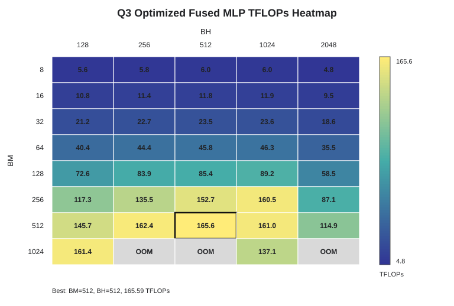

CSEP 590A - Systems for ML

Name      : Aaron Chen  
Student ID: aaronyc  

# Section 1

### Q1: Briefly describe the following components of the memory-heirarchy in TPUs: HBM, VMEM, SMEM, VREG, SREG. What is the size of HBM, VMEM, and SMEM in TPU v5e? 

+ HBM: Off-chip high-bandwidth memory. It stores large tensors and global data, but has higher latency and lower bandwidth than on-chip memory.
+ VMEM: On-chip vector memory/SRAM used to store vector or tensor tiles close to the compute units.
+ SMEM: On-chip scalar memory/SRAM used to store scalar values close to the compute units.
+ VREG: Vector registers that hold vector values loaded from VMEM for vector computation.
+ SREG: Scalar registers that hold scalar values loaded from SMEM for scalar computation.

| Component | TPU v5e size |
| --------- | ------------ |
| HBM       | 17 GB        |
| VMEM      | 128 MiB      |
| SMEM      | 1024 KiB     |

### Q2: Briefly describe the various compute units in a TPU. What is the memory bandwidth between HBM and the compute units in TPU v5e? What is the memory bandwidth (exact value not required) between VMEM and the compute units for TPU v5e?

1. Various compute units
    1. MXU (matrix unit): accelerates matrix operations such as `matmul` and `dot`. Each TPU v5e TensorCore has 4 MXUs.
    2. VPU (vector unit): handles elementwise/vector operations such as `add`, `mul`, `exp`, and `where`. Each TPU v5e TensorCore has 1 VPU.
    3. Scalar unit: handles scalar operations and scalar control-flow. Each TPU v5e TensorCore has 1 scalar unit.
2. The memory bandwidth between HBM and the compute units in TPU v5e
    1. HBM bandwidth ~= 820 GB/s
3. The memory bandwidth between VMEM and the compute units for TPU v5e
    1. VMEM is on-chip SRAM and has much higher bandwidth / much lower latency than HBM.

### Q3: What is software-pipelining? What purpose does it serve in writing efficient TPU (or GPU) kernels? What abstractions does Pallas expose to manage pipelining in TPUs? Very briefly describe each abstraction. What is the trade-off involved in pipeline performance when choosing small versus large block sizes? 

1. What is software-pipelining?
    1. Software pipelining is a compiler/software scheduling technique that arranges loads, computation, and stores from different tiles or loop iterations so they can overlap in time.
2. What purpose does it serve in writing efficient TPU (or GPU) kernels?
    1. The purpose of software pipelining is to improve hardware utilization by overlapping data movement and computation.
3. What abstractions does Pallas expose to manage pipelining in TPUs? Very briefly describe each abstraction.
    1. Grid: defines the tiled iteration space of the kernel, i.e. how many subproblems or tiles the kernel runs over.
    2. BlockSpec: defines the shape of each tile and maps each grid index to the corresponding slice of the input/output tensors.
    3. Kernel: defines the computation performed on each tile after the tile has been loaded into on-chip memory.
    4. pallas_call: combines the kernel, grid, BlockSpecs, and output shape into a callable Pallas kernel. With grid and BlockSpecs, it manages the tiled pipelined execution.
    5. Buffered pipeline mode: allows multiple buffers, such as double buffering, so one tile can be computed while another tile is being transferred.
    6. TPU memory spaces: allow buffers to be placed in VMEM, SMEM, or other TPU memory spaces, which is important because TPU pipelining commonly moves data between HBM and VMEM.
4. What is the trade-off involved in pipeline performance when choosing small versus large block sizes?
    1. Small blocks use less on-chip memory and can expose more parallelism, but they create more pipeline iterations and overhead. Each iteration has less computation, so it may be harder to hide memory-transfer latency.
    2. Large blocks do more computation per tile and can improve data reuse and amortize pipeline overhead, but they require more VMEM/register/scratch memory. If the block is too large, it can reduce parallelism or exhaust TPU on-chip resources.

# Section 2

### Q1: Given an input matrix of size `(8192, 8192)`, theoretically infer the number of memory accesses (between HBM and compute units) required to compute SiLU. What is the total size of the memory accesses in bytes? Assume bf16 datatype. 

8192 * 8192 input reads + 8192 * 8192 output writes
= 2 * 8192 * 8192 accesses
= 134,217,728 accesses

bf16 = 2 bytes

134,217,728 * 2 bytes
= 268,435,456 bytes
~= 256 MiB

### Q2: Implement and profile SiLU.

(A) Allocation / deallocation counts from XProf:

| Implementation | Alloc | Dealloc |
| -------------- | ----- | ------- |
| naive (no jit) | 500 | 499 |
| x*sigmoid (no jit) | 200 | 199 |
| naive + jit | 100 | 99 |
| x*sigmoid +jit | 100 | 99 |
| pallas | 100 | 99 |
| jax.nn.silu | 100 | 99 |

(B) JIT operation names from XProf:

| Implementation | JIT ops |
| -------------- | ------- |
| naive (no jit) | `jit_negative`, `jit_exp`, `jit_add`, `jit_true_divide` |
| x*sigmoid (no jit) | `jit_sigmoid`, `jit_multiply` |
| naive + jit | `jit_silu_naive` |
| x*sigmoid +jit | `jit_silu_sigmoid` |
| pallas | `jit_silu_pallas` |
| jax.nn.silu | `jit_silu` |

(C) Observed memory bandwidth:

| Implementation | Time | GB/s | Util |
| -------------- | ---- | ---- | ---- |
| naive (no jit) | 3899.30 us | 137.7 | 16.8% |
| x*sigmoid (no jit) | 2229.64 us | 240.8 | 29.4% |
| naive + jit | 1004.89 us | 534.3 | 65.2% |
| x*sigmoid +jit | 1014.41 us | 529.2 | 64.6% |
| pallas | 1019.24 us | 526.7 | 64.3% |
| jax.nn.silu | 1020.25 us | 526.2 | 64.3% |

SiLU is mostly memory-bound because it is elementwise and has little data reuse. Each element is read, computed, and written back.

(D) Ranking from lowest to highest bandwidth:

naive (no jit) < x*sigmoid (no jit) < jax.nn.silu < pallas < x*sigmoid +jit < naive + jit

The no-jit versions are slower because they have more overhead and less fusion. The jit, Pallas, and JAX built-in versions are close because they avoid most intermediate HBM traffic.

# Section 3

### Q1: Derive the number of floating point operations in terms of M, K, H, and N for the fused MLP operation above. You will use this value to compute FLOPs utilzation for the following questions.

X @ W1 = [M,K] @ [K,H] = [M,H]  
FLOPs = 2 * M * K * H

SiLU(X @ W1) @ W2 = [M,H] @ [H,N] = [M,N]  
FLOPs = 2 * M * H * N

SiLU is applied element-wise to the [M,H] intermediate matrix. Its element-wise cost is much smaller than the two matrix multiplications, so the FLOPs utilization below uses the matmul FLOPs.

Total FLOPs = 2 * M * K * H + 2 * M * H * N = 2 * M * H * (K + N)

### Q2: Naive fused MLP experiments.

For `(M,K,N)=(4096,1024,1024)` and `BM=1024`:

| H | Status | TFLOPs | Util |
| - | ------ | ------ | ---- |
| 512 | ok | 44.33 | 22.50% |
| 1024 | ok | 58.33 | 29.61% |
| 2048 | OOM | - | - |
| 4096 | OOM | - | - |
| 8192 | OOM | - | - |
| 16384 | OOM | - | - |

The kernel starts exhausting resources at `H=2048`. The naive kernel materializes full `W1`, full `W2`, and the `[BM,H]` hidden matrix, so VMEM usage grows with `H`.

Largest successful `H = 1024`. BM sweep:

| BM | TFLOPs | Util |
| -- | ------ | ---- |
| 8 | 23.33 | 11.84% |
| 16 | 35.79 | 18.17% |
| 32 | 45.74 | 23.22% |
| 64 | 59.37 | 30.14% |
| 128 | 62.97 | 31.97% |
| 256 | 67.10 | 34.06% |
| 512 | 62.14 | 31.54% |
| 1024 | 56.86 | 28.86% |

Best block size is `BM=256`. Utilization improves when BM increases because larger tiles amortize overhead and improve reuse, but too-large BM increases VMEM/register pressure and utilization drops.

### Q3: Optimized fused MLP experiments.

For `(M,K,H,N)=(4096,1024,16384,1024)`, the best tile size is:

`BM=512, BH=512`: `165.59 TFLOPs`, `84.06%` utilization.

OOM tile sizes:

| BM | BH |
| -- | -- |
| 1024 | 256 |
| 1024 | 512 |
| 1024 | 2048 |

The optimized kernel works for much larger `H` because it only materializes `[K,BH]`, `[BH,N]`, and `[BM,BH]` tiles. The best tile balances reuse and VMEM usage. Very small tiles have too much overhead; very large tiles can exhaust VMEM.

