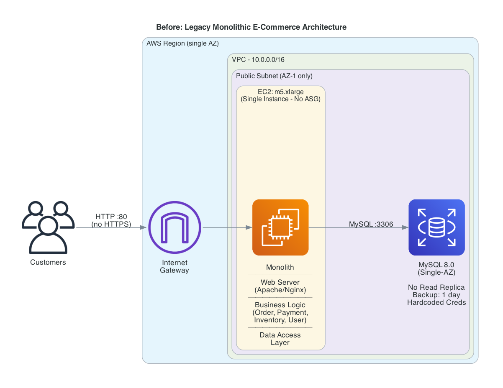
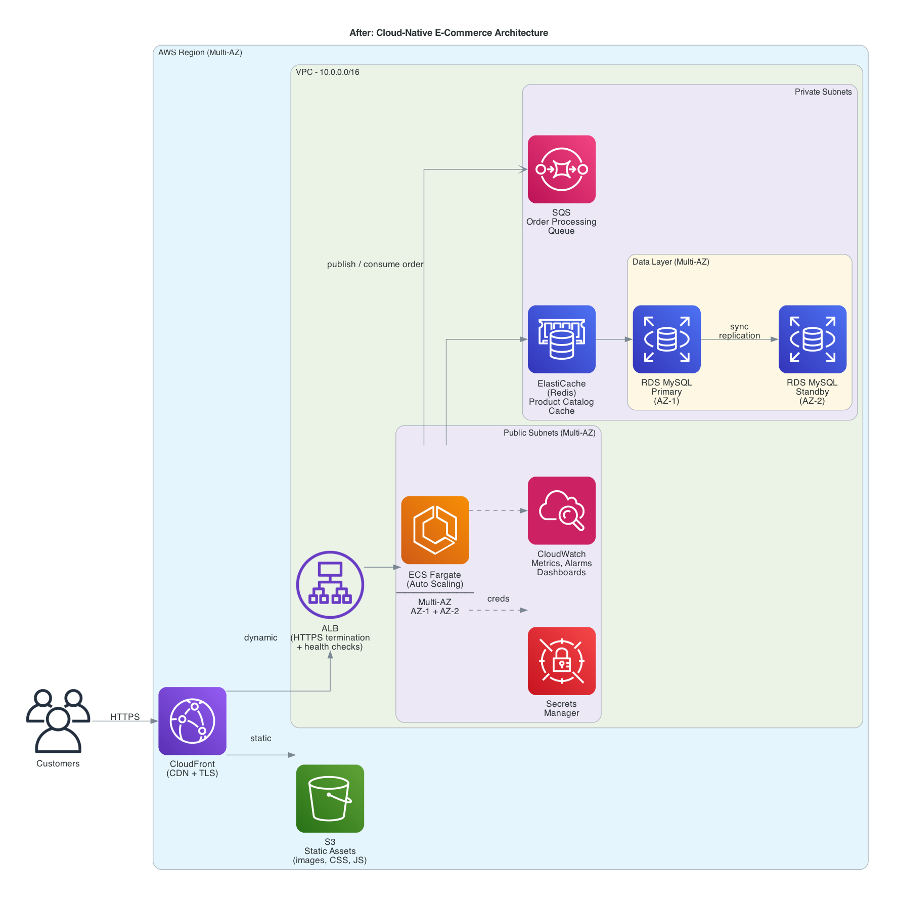

## From Monolith to Cloud-Native: Architecture Analysis

### Note

This assignment is available *before* the corresponding lectures will be delivered covering the material. All necessary content will be covered in class no later than the Wednesday before it is due. However, the readings will cover it sooner.

### Objectives

Students will:

- Analyze an existing monolithic application architecture
- Identify violations of cloud-native and Well-Architected principles
- Propose refactoring strategies using cloud design patterns

### Scenario

You are given a description of a **legacy monolithic web application**:

- Single-tier deployment (web + business logic + data access)
- Manual deployments
- Vertical scaling only
- Single relational database
- No observability beyond basic logs

The application is experiencing:

- Unpredictable load spikes
- Long deployment downtimes
- Increasing operational burden

### Tasks

1. **Architecture Review**
   - Identify major architectural components
   - Map components to logical layers (compute, data, integration, edge)
   - Identify single points of failure

2. **Well-Architected Assessment**
   - For each pillar:
     - Identify at least **2 weaknesses**
     - Explain the operational or business impact

3. **Refactoring Proposal**
   - Propose a cloud-native target architecture
   - Identify **3–5 design patterns** to apply (e.g., Strangler Fig, Managed Identity, Cache-Aside)
   - Explain tradeoffs (what improves, what gets more complex)

### Deliverables

- **Architecture critique memo** (2–3 pages)
- High-level **before/after architecture diagram**

### Evaluation Criteria

- Depth of architectural reasoning
- Correct application of Well-Architected principles
- Clarity of tradeoff analysis

 

## Architecture critique memo

### Before Architecture

### After Architecture

### Scenario

This analysis examines a legacy monolithic e-commerce platform that serves an online storefront, handling product catalog browsing, user authentication, shopping cart management, order processing, payment transactions, and inventory tracking. The entire application is deployed as a single unit on AWS, with all layers tightly coupled on one EC2 instance backed by a single MySQL database. The platform is experiencing unpredictable traffic spikes during promotional events, prolonged downtime during deployments, and a growing operational burden on the engineering team.

### Tasks

1. **Architecture Review**
    - Identify major architectural components
        - **Web / Presentation Layer** - Apache/Nginx web server serving the e-commerce storefront (product pages, checkout UI, account pages)
        - **Business Logic Layer** - Application code handling order processing, payment transactions, inventory management, and user authentication, all running as a single process
        - **Data Access Layer** - ORM and database queries tightly coupled to a single MySQL instance
        - **Database** - Single MySQL 8.0 RDS instance storing all application data (users, products, orders, inventory)
        - **Network Edge** - Internet Gateway providing direct public access to the EC2 instance over HTTP
    - Map components to logical layers (compute, data, integration, edge)
        - **Compute** - Single EC2 instance (m5.xlarge) hosting all three application layers (web server, business logic, data access) as one monolithic process
        - **Data** - Single RDS MySQL 8.0 instance serving as the sole data store for all domains (users, products, orders, inventory)
        - **Integration** - None; all inter-component communication occurs via in-process function calls, with no messaging, event bus, or API abstraction between services
        - **Edge** - Internet Gateway exposing the EC2 instance directly over HTTP, with no load balancer, CDN, or TLS termination
    - Identify single points of failure
        - **EC2 instance** - The sole compute node; if it crashes or requires maintenance, the entire storefront becomes unavailable with no automatic recovery (no ASG, no health check)
        - **RDS MySQL (Single-AZ)** - No Multi-AZ failover and no read replica; a database failure or AZ incident results in complete loss of data access, including all order and payment operations
        - **Single AZ deployment** - Both compute and data reside in one Availability Zone, meaning an AZ-level outage takes down the entire platform simultaneously

2. **Well-Architected Assessment**
    - **Operational Excellence**
        - **No observability** - No CloudWatch metrics, alarms, or dashboards. The team cannot detect abnormal traffic or diagnose performance bottlenecks in real time; issues are often discovered only after customers are already affected.
        - **Manual deployment with downtime** - Deployment is done via SSH to the single instance, with no CI/CD pipeline or rollback mechanism. When issues occur, manual intervention is the only option, which extends downtime significantly.
    - **Security**
        - **No HTTPS** - All sensitive data is transmitted without encryption; customer information such as phone numbers and credit card numbers could be intercepted in transit.
        - **Hardcoded credentials in database configuration** - The database password is stored in plaintext within the CloudFormation template, meaning anyone with repository access can view it. Additionally, if the instance is compromised, attackers can directly obtain the credentials and access all customer data. The hardcoded approach also prevents password rotation.
    - **Reliability**
        - **Single AZ, no failover** - When the AZ becomes unavailable, the entire service goes down and no customers can access the website. There is no standby instance or automated failover to recover from the outage.
        - **Minimal backup retention** - RDS backups are retained for only 1 day, with no Multi-AZ failover and no read replica. If data corruption or accidental deletion occurs and is not caught within 24 hours, customer data is permanently lost.
    - **Performance Efficiency**
        - **No auto-scaling** - When traffic spikes occur, the single instance cannot scale to handle the increased load, resulting in degraded performance; customers experience slow page loads or timeouts.
        - **No caching layer** - Every request hits the database directly, including repeated reads for product catalog and inventory. This creates unnecessary load on RDS and increases response latency, especially during traffic spikes.
    - **Cost Optimization**
        - **Over-provisioned single EC2** - A single large EC2 instance (m5.xlarge) is more expensive than distributing the workload across multiple smaller instances. During off-peak hours, the instance continues running at full capacity, wasting compute resources and budget.
        - **No use of cost-efficient managed services** - Static assets such as product images, CSS, and JavaScript are served through the EC2 instance instead of using S3 with CloudFront, which would be cheaper and offload compute resources.
    - **Sustainability**
        - **No serverless or auto-scaling services** - The EC2 and RDS instances run at full capacity 24/7 regardless of demand, consuming energy even during off-peak hours. Adopting serverless or auto-scaling services would allow unused resources to be released back to the shared infrastructure.
        - **No caching** - Without a caching layer, the system repeatedly queries the database for identical data (e.g., product catalog), performing redundant computation and consuming unnecessary energy.

3. **Refactoring Proposal**
    - Propose a cloud-native target architecture

        First, to address the single-tier deployment, long deployment downtimes from manual deployments, and vertical-scaling-only limitations, we adopt a microservice architecture on ECS Fargate. This eliminates the need to manage underlying infrastructure (unlike self-hosted Kubernetes), and enables auto-scaling to handle unpredictable load spikes far more effectively than a single EC2 instance. An Application Load Balancer (ALB) is placed in front of the ECS services to perform HTTPS termination, health checks, and path-based routing to each microservice.

        Second, to resolve the single relational database problem, we deploy RDS MySQL in a Multi-AZ configuration with a primary and standby instance in separate Availability Zones. This provides automatic failover for high availability and extends backup retention beyond the original 1-day window.

        Third, we introduce an integration layer using SQS to decouple order processing from downstream services (inventory, payment), allowing the system to absorb traffic bursts asynchronously rather than overloading the database with synchronous writes.

        Fourth, we add ElastiCache (Redis) as a caching layer in front of RDS. Frequently read data such as the product catalog and inventory status is served from cache, significantly reducing database load and improving response latency.

        Fifth, we place CloudFront as the entry point for all customer traffic, providing TLS encryption and CDN caching. Static assets (product images, CSS, JavaScript) are served from S3 through CloudFront, offloading these requests entirely from the compute layer.

        Sixth, we replace the hardcoded database credentials with AWS Secrets Manager, enabling automatic password rotation and eliminating plaintext secrets from the codebase.

        Lastly, we set up CloudWatch to collect metrics, dashboards, and alarms. This gives the team observability beyond basic logs, enabling proactive monitoring and reducing operational burden through automated alerting.

    - Identify 3-5 design patterns to apply

        | Architecture Decision | Design Pattern |
        |---|---|
        | Gradually migrate the monolithic services running on EC2 to a microservice architecture on ECS Fargate | Strangler Fig |
        | Use SQS to decouple order processing, notifying inventory and payment services asynchronously | Publish-Subscribe |
        | Route traffic to different microservices (/orders, /products, /users, etc.) based on URL path via ALB | Path Routing |
        | Place a circuit breaker in front of the payment service to prevent cascading failures when it becomes unresponsive | Circuit Breaker |
        | Implement retry with exponential backoff for transient failures in inter-service communication | Retry with Backoff |

    - Explain tradeoffs (what improves, what gets more complex)

        | What Improves | What Gets More Complex |
        |---|---|
        | High availability through Multi-AZ and auto-scaling eliminates downtime during failures and traffic spikes | Infrastructure cost increases significantly; a standby RDS instance alone doubles the database cost |
        | Microservice architecture enables independent deployment and scaling of each service | Higher learning curve for developers; operating a distributed system requires more skills (container orchestration, async messaging, monitoring) |
        | CloudWatch provides observability with metrics, dashboards, and alarms for proactive monitoring | Debugging becomes harder across distributed services; not all incidents can be captured by metrics, and tracing requests across microservices requires additional tooling |