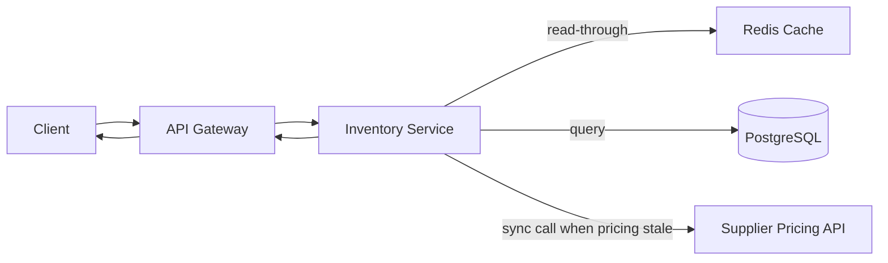
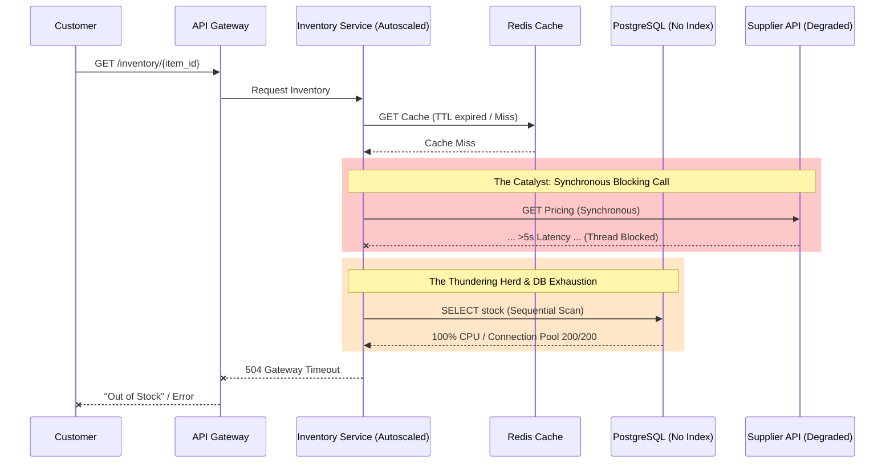

# 1. Executive Summary

On March 18, Acme's Inventory Service suffered a major degradation lasting 94 minutes (09:07–10:41), with peak impact between 09:11 and 10:27. Customers intermittently saw incorrect "Out of Stock" messages and experienced frequent cart/checkout timeouts, contributing to an 18% drop in checkout completion during the incident window. The incident was triggered by enabling real-time supplier pricing sync, which increased synchronous dependency calls and amplified database load during a period of elevated cache misses, leading to cascading latency and errors. The engineering team mitigated the issue by disabling the feature flag, restoring cache settings, and performing a database failover, after which latency and error rates returned to normal.

# 2. Detailed Customer Impact Section

1) **Requests failing**
    - During peak impact, the Inventory Service error rate exceeded 22% (alert at 09:14). Customers also experienced API Gateway 504 Gateway Timeouts.

2) **Latency spikes**
    - Inventory Service p95 latency exceeded 4 seconds starting at 09:07. Redis latency increased from ~3ms to ~200ms and then experienced timeouts. The downstream Supplier Pricing API latency exceeded 5 seconds after ~09:28 (regional slowdown), contributing to end-to-end request latency.

3) **Business metrics (checkout drop)**
    - Checkout completion dropped by 18% during the incident window. Customers intermittently saw incorrect "Out of Stock" responses for items that were actually in stock.

4) **Regions affected**
    - All regions served by this cluster.

5) **SLO violations**
    - Availability (< 99.9%): Breached. Availability dropped to approximately 78% during peak impact.
    - Latency (p95 < 300ms): Breached. Violated continuously for 94 minutes.
    - Error Rate (< 0.1%): Breached. Peaked at > 22% during the incident window.

6) **Duration per symptom**
    - High Latency - 94 minutes (09:07 - 10:41)
    - High Error Rate - 73 minutes  (09:14 - 10:27)
    - Cache Miss Spike - 15 minutes (09:21 - 09:36)

# 3. Precise Incident Timeline (with minute-level detail)

| Time    | Type                             | Event                                                     |
|---------|----------------------------------|-----------------------------------------------------------|
| -2 Days | change                           | Table index `inventory(item_id)` was accidentally dropped |
| Recent  | change                           | Cache TTL for item stock was reduced from 6h -> 15min     |     
| 09:05   | deployment/feature-flag actions  | New feature enable "Real-Time Supplier Pricing Sync"      |
| 09:07   | alert triggers                   | Alert: "InventoryService p95 latency > 4s"                |
| 09:09   | alert triggers                   | Alert: "Redis errors increasing (CONNECTION_TIMEOUT)"     |
| 09:11   | alert triggers                   | Alert: "DB CPU 98% (critical)"                            |
| 09:14   | alert triggers                   | Alert: "InventoryService error rate > 22%"                |
| 09:15   | human actions                    | On-call acknowledges                                      |
| 09:21   | observed changes in system state | Queries cache missing rate from 5% to 72%                 |
| 09:28   | observed changes in system state | Supplier Pricing API regional slowdown beginning          |
| 09:31   | automated responses              | Autoscaler added 2 pods                                   |
| 09:46   | observed changes in system state | Supplier Pricing API latency > 5s                         |
| 09:52   | mitigating steps + human actions | On-call manually toggled off the feature flag             |  
| 10:00   | mitigating steps                 | Redis cluster restarted                                   |  
| 10:02   | observed changes in system state | DB connection pool saturated (200/200)                    |
| 10:19   | mitigating steps + human actions | Failover initiated manually                               |
| 10:27   | observed changes in system state | System stabilizing                                        |
| 10:41   | observed changes in system state | Alerts clear                                              |

# 4. Root Cause Analysis

## A. Trigger

Enabling the "Real-Time Supplier Pricing Sync" feature flag at 09:05 increased the critical-path work per inventory lookup and triggered the initial latency increase.

**Evidence**
- 09:05 - Feature flag "Real-Time Supplier Pricing Sync" enabled
- 09:07 - Alert: InventoryService p95 latency > 4s

## B. Contributing Factors

These conditions amplified the impact after the trigger:

1) **Degraded database query performance**
    - A critical index on `inventory(item_id)` had been dropped earlier, increasing per-request DB cost and making the system sensitive to traffic/cache changes.

2) **Cache effectiveness reduced, causing a cache-miss amplification**
    - Stock cache TTL was reduced from 6h to 15m, coinciding with a cache miss spike (5% -> 72%), increasing read pressure on the database.

3) **External dependency latency propagated into the request path**
    - The feature makes synchronous calls to the Supplier Pricing API; a regional slowdown increased end-to-end latency and contributed to cascading failures.

4) **Resource saturation limited recovery**
    - DB CPU reached critical levels and the DB connection pool saturated; autoscaling added pods but did not relieve the DB bottleneck.

**Evidence**
- -2 days - DBA confirmed index on `inventory(item_id)` was accidentally dropped
- Recent - Cache TTL reduced from 6h -> 15m
- 09:11 - Alert: DB CPU 98% (critical); CPU 100% observed until 10:25
- 09:21 - Cache miss rate spike from 5% -> 72%
- 09:28 - Supplier Pricing API regional slowdown begins
- 09:31 - Autoscaler added 2 pods; still overloaded
- 10:02 - DB connection pool saturated (200/200)

## C. True Root Cause(s)

1) **Unsafe rollout / lack of guardrails for feature-flag changes**
    - The feature was enabled broadly without canarying and without automated rollback gates based on SLI/SLO thresholds.
2) **Insufficient change management for database migrations**
    - A critical index was dropped and not detected via automated checks (schema validation, query-plan regression tests, or index drift monitoring), allowing a latent performance defect to reach production.
3) **Lack of resilience patterns for external dependencies and degradation**
    - Synchronous dependency calls lacked isolation/timeout/fallback behavior (e.g., circuit breaker/bulkhead/stale pricing fallback), allowing Supplier Pricing API latency to cascade into Inventory lookups.

**Evidence**
- 09:05 - Feature flag enabled
- 09:07-09:14 - Severe latency/error alerts triggered shortly after enablement
- -2 days - Index dropped (DBA confirmation)
- Query heatmap top offender: `SELECT stock FROM inventory WHERE item_id = ?`
- Slack: "Why is DB using sequential scan?" (indicates plan regression)
- Design note: synchronous Supplier Pricing API call on inventory lookup when pricing is stale
- 09:28 - Supplier Pricing API slowdown begins
- 09:46 - latency > 5s alert
- Slack: "If Supplier Pricing API is slow, do we block inventory?" (unclear fallback behavior)

## D. Why It Was Not Detected Earlier

1) **Rollout procedure**
    - No canary or progressive delivery for the feature flag
    - no automated SLI-based rollback when p95 latency/error rate spiked.

2) **Testing**
    - No pre-deployment load/stress testing covering the combined effect of
        - reduced cache TTL
        - synchronous dependency calls
        - degraded DB query plans

3) **Monitoring / alerts / observability**
    - Missing proactive alerts for index drift / query plan regression (e.g., sequential scan on a hot path), and insufficient dashboards to quickly correlate cache miss spikes -> DB CPU saturation -> connection pool exhaustion -> user-facing errors.

# 5. Technical Deep Dive

+ Service Architecture

+ Sequence Diagram

1) **Dropped index and query plan regression**
    - The index on `inventory(item_id)` was accidentally dropped, causing a query plan regression for the hot-path lookup `SELECT stock FROM inventory WHERE item_id = ?`, which is top offender in the query heatmap, and Slack noted sequential scans. With the index missing, PostgreSQL likely shifted from an index-based plan to a slower scan-based plan, dramatically increasing per-request DB cost. This drove DB CPU to 100% and eventually exhausted the DB connection pool, which propagated into elevated latency and timeouts at the service and API gateway level.

2) **Synchronous Supplier Pricing calls and tail-latency amplification**
    - With the feature flag enabled, when an item's pricing was older than 12 hours the Inventory Service performed a synchronous call to the Supplier Pricing API on the request critical path. When the Supplier API experienced a regional slowdown, requests spent longer waiting on the dependency, tying up goroutines and increasing in-flight concurrency and queueing. This amplified tail latency (p95), increased timeouts/error rates, and manifested upstream as API Gateway 504s.

3) **Cache-miss spike, Redis latency, and connection pool saturation**
    - Reducing the stock cache TTL from 6h to 15m likely increased expiry-driven cache misses, which amplified load on Redis and shifted more requests to PostgreSQL, contributing in DB CPU saturation and DB connection pool exhaustion.

4) **PostgreSQL behavior under CPU saturation and connection exhaustion**
    - When PostgreSQL CPU is pinned near 100%, query execution time increases, so each request holds a DB connection for longer. Because the DB connection pool is finite (200/200), new requests may be unable to acquire a connection and will queue until they time out, amplifying tail latency and error rates upstream. The manual failover at 10:19 can temporarily improve performance by moving traffic to a healthier node, but the degradation may recur if the underlying query efficiency issue is not addressed.

5) **TTL reduction and traffic pattern shifts**
    - Reducing TTL from 6h to 15min makes cache entries expire about 24× more frequently, increasing cache churn and the likelihood of latency spikes. Under peak traffic, many requests can simultaneously hit recently expired keys, creating expiry-driven bursts of cache misses, which shifts load to PostgreSQL and increases DB query concurrency.

6) **Was this a thundering herd?**
    - Possibly: the abrupt miss-rate spike is consistent with an expiry-driven cache stampede that shifted load to PostgreSQL.

7) **Why Kubernetes autoscaling did not mitigate the incident**
    - Autoscaling added more pods, but the bottleneck was in shared dependencies rather than pod compute. PostgreSQL was already saturated and the DB connection pool was exhausted, while Redis was experiencing high latency/timeouts. Adding pods could not increase DB/Redis capacity and likely increased concurrent load and connection contention, so overall latency and error rates remained high until mitigations took effect.

# 6. Mitigation & Short-Term Fixes

| Time    | Actor                 | Action                                                  | Observed outcome / notes                                 |
|---------|-----------------------|---------------------------------------------------------|----------------------------------------------------------|
| 09:15   | On-call               | Acknowledged incident                                   | Incident response initiated                              |
| 09:31   | Kubernetes autoscaler | Added 2 pods                                            | Still overloaded; bottleneck downstream (DB/Redis)       |
| 09:52   | On-call               | Disabled feature flag "Real-Time Supplier Pricing Sync" | Helped reduce dependency pressure; system still degraded |
| 10:00   | On-call / Platform    | Restarted Redis cluster                                 | Reported "did not help much"                             |
| 10:19   | On-call / DBA         | Initiated DB failover manually                          | Performance improved; stabilizing at 10:27               |
| 10:27   | Team                  | Confirmed system stabilizing                            | Recovery observed                                        |
| 10:41   | Monitoring            | Alerts cleared                                          | Back to normal range                                     |
| Unknown | Team                  | Increased Redis connection pool                         | Time not provided in raw inputs                          |
| Unknown | Team                  | Temporarily increased cache TTL to 1 hour               | Time not provided in raw inputs                          |

# 7. Long-Term Preventive Actions

| Action item | Owner | Deadline | Measurable outcome | Dependencies | Type (Operational / Architectural) |
|---|---|---|---|---|---|
| Restore and protect `inventory(item_id)` index | DBA Team | +7 days | - Index exists in prod - query plan for `SELECT stock ... WHERE item_id=?` uses index scan - p95 DB query latency for this endpoint < target under load test | - Migration pipeline access - schema change approval | Operational + Architectural |
| Add automated DB migration safeguards (index drift + plan regression checks) | Platform/DB Reliability | +30 days | - CI fails if a migration drops critical indexes - nightly job detects index drift - alerts on sequential scans for hot queries | - CI/CD integration - query monitoring (pg_stat_statements) | Operational |
| Implement circuit breaker + timeout + fallback for Supplier Pricing API | Inventory Service Team | +30 days | - When Supplier API latency > threshold, inventory endpoint returns without blocking (uses cached/stale pricing or skips pricing) - no cascading 504s in failure drill | - Client library support - product agreement on stale pricing behavior | Architectural |
| Make pricing sync asynchronous (decouple from request critical path) | Inventory Service Team | +45 days | - Pricing refresh moved to background job/queue - inventory lookup no longer performs synchronous Supplier calls - p95 latency stable under Supplier slowdown test | - Queue/worker infra - data model updates | Architectural |
| Add cache stampede protection (request coalescing / singleflight per key) | Inventory Service Team | +21 days | - Under TTL expiry load test, miss spikes do not cause DB QPS surge beyond threshold - DB CPU remains < threshold | - Service code changes - load test harness | Architectural |
| Revisit cache TTL strategy with load testing and staged rollout | SRE + Inventory Team | +14 days | - TTL changes require load test results and canary rollout - documented TTL policy - no >X% miss spike during canary | - Agreement on freshness requirements - testing env | Operational |
| Enhance Redis observability + capacity alarms | SRE/Observability | +14 days | - Dashboards for Redis latency, timeouts, connection usage, evictions - alerts trigger before widespread timeouts | - Metrics instrumentation - dashboard ownership | Operational |
| Add feature-flag progressive delivery (canary + automatic rollback gates) | Platform Engineering | +30 days | - Feature flags can be ramped 1%→10%→100% - auto-rollback on p95/error SLI breach - audit log of flag changes | - Feature flag system - SLI definitions | Operational |

# 8. Lessons Learned

- Putting synchronous dependency calls on the request critical path amplifies tail latency and can trigger cascading failures under downstream slowdown.
- TTL reductions can create expiry-driven traffic bursts; cache-aside systems need stampede protection and clear fallback behavior.
- Autoscaling helps only when the bottleneck is in stateless compute; it cannot fix saturated shared backends (DB/Redis) and may worsen contention.
- Safe rollout practices (canary + SLI-based rollback) are essential for feature flags and performance-sensitive config changes.

# 9. Validation Plan

To ensure system resilience and validate the effectiveness of our preventive actions, the engineering team will execute the following plan:

1) **Load Testing**
    - Simulate 150% of peak production traffic against the staging environment to verify that the restored database index (inventory(item_id)) prevents CPU saturation and maintains p95 database latency under 50ms.

2) **Chaos Experiments**
    - Inject artificial network latency (> 10s) and 500 errors into the simulated Supplier Pricing API to validate that the new Circuit Breaker successfully trips, prevents thread exhaustion, and correctly serves fallback stale pricing.

3) **Canary Rollouts**
    - Mandate automated progressive delivery (e.g., 5% → 25% → 100%) for all future feature flags in the CI/CD pipeline, configuring auto-rollbacks if the 0.1% error rate SLO is breached.

4) **Targeted Monitoring**
    - Intentionally execute sequential scans in a non-production environment to verify that the newly configured observability alerts trigger critical paging (e.g., PagerDuty) within 3 minutes of the anomaly.
